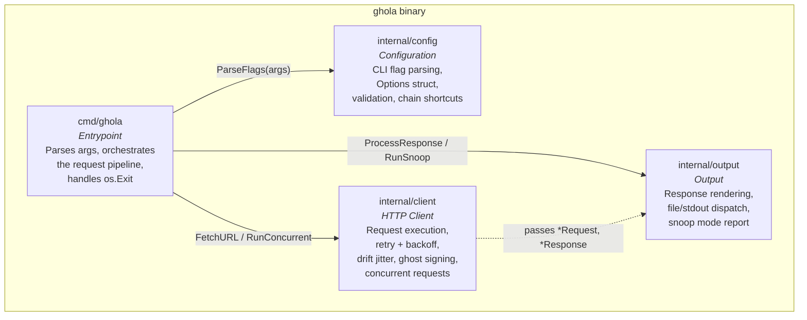

# C4 Component Diagram

Shows the internal package structure of the ghola binary.

## Package Responsibilities

| Package | Responsibility | Key Types/Functions |
|---------|---------------|---------------------|
| `cmd/ghola` | Process entrypoint. Wires config, client, and output together. Only place that calls `os.Exit`. | `main()`, `run()` |
| `internal/config` | CLI flag parsing into a strongly-typed `Options` struct. All validation happens here. | `Options`, `ParseFlags()`, `ExitCode` |
| `internal/client` | HTTP transport layer. Handles retries, drift jitter, ghost identity signing, basic auth, and concurrent execution. Accepts a `Doer` interface for testability. | `FetchURL()`, `RunConcurrent()`, `Doer` |
| `internal/output` | Response rendering to stdout or file. Snoop mode security posture report. Accepts `io.Writer` for testability. | `ProcessResponse()`, `RunSnoop()` |

## Design Decisions

- **No global state**: `Options` is passed explicitly to every function.
- **Dependency injection**: `client.Doer` and `io.Writer` allow full test isolation without network calls or file I/O.
- **`internal/` packages**: Prevents external consumers from depending on implementation details. The public contract is the CLI itself.
