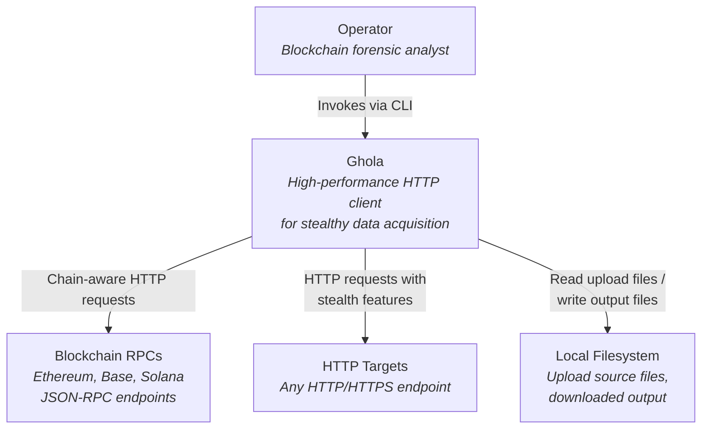

# C4 Context Diagram

Shows ghola in the context of the systems and actors it interacts with.

## Actors

- **Operator**: A blockchain forensic analyst or security researcher who uses ghola as a tactical HTTP scout for data acquisition and endpoint reconnaissance.

## External Systems

| System | Description |
|--------|-------------|
| Blockchain RPCs | JSON-RPC endpoints for Ethereum, Base, Solana. Ghola pre-fills chain-specific headers via `--chain`. |
| HTTP Targets | Any HTTP/HTTPS endpoint. Ghola supports stealth features (drift, ghost signing) to avoid detection. |
| Local Filesystem | Source for `--upload-file` payloads and destination for `--output` / `--wget` downloads. |
