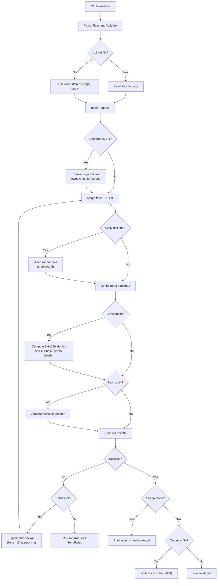

# Request Lifecycle Dataflow

Shows how data flows through ghola from CLI invocation to output.

## Key Data Transformations

| Stage | Input | Output |
|-------|-------|--------|
| Flag parsing | `os.Args` | `*config.Options` |
| Upload file read | File path | `Options.Data` (body string) |
| Ghost signing | Timestamp + URL | SHA256 hex → `X-Ghola-Identity` header |
| Basic auth | `user:password` | Base64 → `Authorization: Basic ...` header |
| Chain shortcut | Chain name (eth/base/sol) | `X-Chain: {chain}` header |
| Drift jitter | Max ms | Crypto-random sleep duration |
| Retry backoff | Base ms + attempt count | `base * 2^(attempt-1)` ms sleep |

## Error Flow

Errors propagate upward as return values. Only `cmd/ghola/main.go` converts errors into exit codes:

| Condition | Exit Code |
|-----------|-----------|
| Invalid flags or missing URL | `1` (BadFlag) |
| HTTP request failed after all retries | `2` (SendFailed) |
| Upload file unreadable | `3` (ReadFileFailed) |
| Output file unwritable | `4` (WriteFileFailed) |
| Success | `0` (NoError) |
